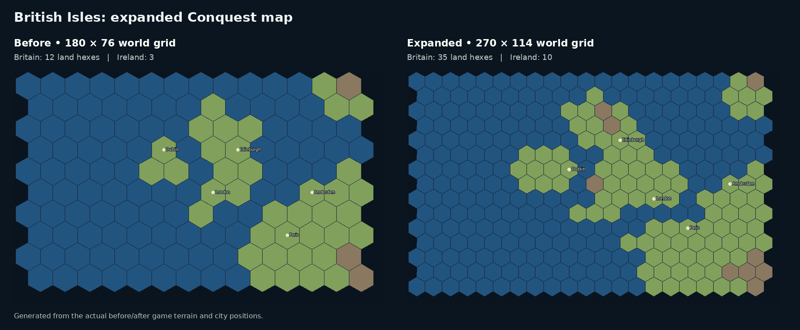

# Expanded world geography

The reference is the European conquest map in [EasyTech’s official World Conqueror 4 screenshots](https://easytech.itch.io/world-conqueror-4). The map follows its emphasis on legible country silhouettes, distinct islands, coastal approaches and useful room to manoeuvre.

| Measure | Before expansion | Expanded map |
| --- | ---: | ---: |
| World grid | 180 × 76 | 270 × 114 |
| Total hexes | 13,680 | 30,780 |
| Land hexes | 4,412 | 9,907 |
| Great Britain connected land hexes | 12 | 35 |
| Ireland connected land hexes | 3 | 10 |
| Conquest cities | 149 | 149 |

## British Isles

- Redraw Britain with a broader Highland coastline, a narrower central spine, a distinct Welsh coast, East Anglia, southeast England and a Cornwall/Devon arm.
- Keep Ireland separate across the Irish Sea and keep the English Channel navigable.
- Move London to southeast England, Edinburgh north, and Dublin south on Ireland. London's starting formation follows the city; its Sakuradite deposit remains linked to the city refinery.
- Add distinct mountain hexes for the Highlands and Welsh uplands.

## Worldwide

- Re-rasterize every continent and biome at 1⅓° longitude per column and roughly 1.133° latitude per row.
- Preserve previous strategic land/sea edits by reprojecting their old-grid footprints rather than reusing their column/row numbers.
- Add or refine Vancouver Island, Newfoundland, the Bahamas, Jamaica, Puerto Rico, Corsica, Sicily, Crete, Cyprus, Shikoku, Okinawa, the central Philippines, Bali, Flores, Sumba and Timor.
- Keep Singapore, Sri Lanka, Taiwan, Luzon/Visayas/Mindanao, Sicily, Newfoundland, Vancouver Island, Timor/Flores and New Zealand's main islands separated.
- Paint continuous navigable routes through Gibraltar, Bab-el-Mandeb and Otranto, alongside the retained Baltic, Black Sea and Malacca passages.
- Place Tokyo on an eastern coastal hex so Mount Fuji remains a distinct Sakuradite mine.
- Preserve the geographic footprint of the Himalaya and Greenland impassable terrain at the finer resolution.

## Gameplay and saves

City tiers, resource totals, starting force counts and movement stats retain their existing values. The finer grid makes long routes require more turns. Campaign maps keep their existing dimensions. A new Conquest is required: the existing dimension guard rejects older-grid saves rather than loading old coordinates into the new terrain. HQ progression remains separate from the Conquest map.

## Validation

All 60 Node engine/campaign/art tests, the UI smoke test, four Python art-pipeline tests and tracked-asset validation passed. The world-map test covers the expanded British Isles, island separation, mainland routes, naval passages, city/army placement, resource anchors and rejection of old-grid saves.
